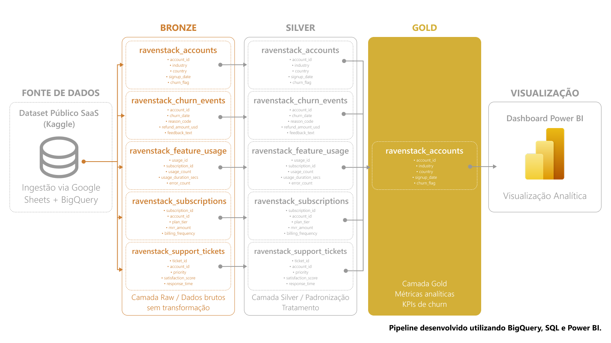
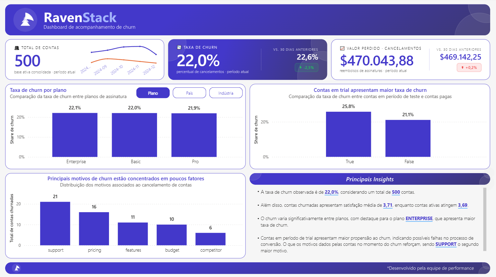

# RavenStack | Análise de Churn SaaS

Projeto completo de análise de churn desenvolvido com foco em engenharia de dados, modelagem analítica e visualização estratégica.

O projeto simula o cenário de uma empresa SaaS fictícia chamada RavenStack, utilizando um dataset público para analisar padrões de cancelamento, engajamento de usuários e fatores associados ao churn.

Todo o pipeline foi estruturado utilizando arquitetura medalhão no BigQuery, com transformação dos dados via SQL e construção de dashboard analítico no Power BI.

## Objetivo de Negócio

O principal objetivo do projeto foi identificar padrões e comportamentos associados ao churn de clientes em um ambiente SaaS.

A análise busca responder perguntas como:

- Contas em período de trial apresentam maior churn?
- Existem diferenças de churn entre planos?
- Quais motivos aparecem com maior frequência nos cancelamentos?
- Engajamento e satisfação impactam retenção?
- Existem segmentos com maior risco de cancelamento?

Além da análise visual, o projeto também teve como objetivo praticar conceitos de:
- Arquitetura medalhão
- ETL em BigQuery
- Modelagem analítica
- Storytelling com dados
- Construção de dashboards executivos

  ## Arquitetura do Projeto

O pipeline foi estruturado utilizando arquitetura medalhão, separando os dados em diferentes camadas de tratamento e consumo analítico.

### Fluxo do pipeline

1. Ingestão dos dados públicos no BigQuery
2. Armazenamento dos dados brutos na camada Bronze
3. Limpeza, padronização e tratamento na camada Silver
4. Consolidação analítica e criação de métricas na camada Gold
5. Construção do dashboard analítico no Power BI

### Arquitetura visual



## Stack Utilizada

| Ferramenta | Finalidade |
|---|---|
| BigQuery | Armazenamento e processamento dos dados |
| SQL | Transformações e modelagem analítica |
| Power BI | Visualização e construção do dashboard |
| Google Sheets | Apoio na ingestão inicial dos dados |
| Figma | Documentação visual da arquitetura |

## Pipeline de Dados

O projeto foi estruturado seguindo o conceito de arquitetura medalhão, separando os dados em diferentes níveis de maturidade analítica.

### Bronze | Dados brutos

Camada responsável pelo armazenamento dos dados originais sem transformações.

Tabelas:
- ravenstack_accounts
- ravenstack_churn_events
- ravenstack_feature_usage
- ravenstack_subscriptions
- ravenstack_support_tickets

Principais objetivos:
- Preservar dados originais
- Garantir rastreabilidade
- Centralizar ingestão

---

### Silver | Limpeza e padronização

Camada responsável pela limpeza, padronização e tratamento dos dados.

Transformações realizadas:
- Padronização de colunas
- Ajustes de tipos de dados
- Tratamento de valores
- Renomeação de campos
- Consolidação de métricas intermediárias

Tabelas:
- silver_accounts
- silver_churn_events
- silver_feature_usage
- silver_subscriptions
- silver_support_tickets

---

### Gold | Camada analítica

Camada final utilizada para consumo analítico e construção do dashboard.

Tabela principal:
- ravenstack_account_gold

Métricas consolidadas:
- Share de churn
- Uso médio da plataforma
- Tempo médio de utilização
- Tickets por conta
- Satisfação média
- Tempo de vida da conta
- Motivos de churn

## Dashboard Analítico

O dashboard foi desenvolvido com foco em análise executiva e identificação de padrões associados ao churn.

A proposta visual foi manter uma interface limpa e objetiva, priorizando:
- Clareza na leitura
- Storytelling analítico
- KPIs estratégicos
- Comparações entre segmentos
- Insights acionáveis

### Principais indicadores

- Taxa de churn
- Tempo médio de atividade
- Uso médio da plataforma
- Satisfação média
- Motivos de cancelamento
- Comparações por plano, país e indústria

### Recursos implementados

- Parâmetros dinâmicos
- Títulos dinâmicos
- Insights automatizados via DAX
- Navegação simplificada
- Visual minimalista focado em análise

### Dashboard principal



## Principais Insights

Durante a análise, alguns padrões relevantes foram identificados:

- Contas em período de trial apresentaram maior taxa de churn
- Certos planos concentraram níveis mais elevados de cancelamento
- Motivos relacionados a suporte e precificação apareceram com frequência nos churns
- Contas com menor satisfação apresentaram tendência maior de cancelamento
- Diferenças relevantes foram observadas entre países e segmentos de indústria

A análise indica que fatores relacionados à experiência do usuário e engajamento possuem forte relação com retenção.

## Aprendizados

Durante o desenvolvimento do projeto, foi possível aprofundar conhecimentos em:

- Estruturação de pipelines analíticos
- Arquitetura medalhão
- Transformações SQL no BigQuery
- Modelagem para consumo analítico
- Construção de dashboards executivos
- Storytelling com dados
- Criação de parâmetros dinâmicos no Power BI
- Documentação de projetos para portfólio

Além da parte técnica, o projeto também reforçou a importância de simplificar visualizações e priorizar clareza analítica na construção de dashboards.

## Próximos Passos

Possíveis evoluções futuras para o projeto:

- Criação de análises de cohort e retenção
- Publicação do dashboard no Power BI Service
- Expansão da modelagem analítica
- Automatização da ingestão de dados

  ## Estrutura do Projeto

```text
ravenstack-churn-analysis/
│
├── sql/
│   ├── bronze/
│   ├── silver/
│   └── gold/
│
├── screenshots/
│
├── powerbi/
│
├── docs/
│
└── README.md
```
